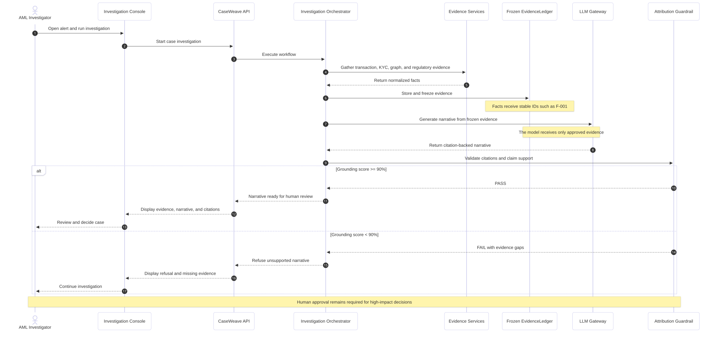
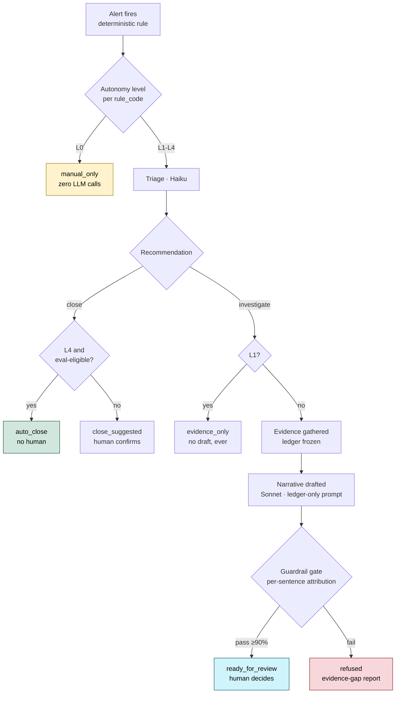

<div align="center">

# CaseWeave

**An agentic AML investigation copilot that refuses to guess.**

[](https://github.com/AaronFChristian/caseweave/actions/workflows/ci.yml)
[](https://www.python.org/)
[](#testing--evaluation)
[](#design-thesis)
[](#license)

Triages AML alerts, assembles evidence from a transaction knowledge graph, and drafts a
regulatory filing narrative where **every sentence is either provably grounded in
evidence or refused outright.**

[Architecture](#architecture) · [Design Thesis](#design-thesis) · [Key Features](#key-features) · [Quickstart](#quickstart)

</div>

> **All data in this repository is synthetic.** No real customer transactions, no real
> borrower financials, no real filings. The entire dataset is generated from a fixed
> seed. This is a portfolio system demonstrating architecture, evaluation design, and
> observability practice for grounded generation in a regulated, high-stakes domain.

---

## At a glance

| | | |
|---|---|---|
| **91% → 100%** planted-subject recall once graph-only detection came online | **≥ 90%** sentence-level attribution threshold before a narrative is released | **69** tests, all wired into CI on every push |
| **12** architecture layers, each with an honest implementation status | **5** guardrail-checked stages between evidence and a reviewer's screen | **$0.03 → $0.00** cost swing from a single autonomy-ladder config change |

---

## Table of contents

- [The problem](#the-problem)
- [Design thesis](#design-thesis)
- [Architecture](#architecture)
- [Runtime flow](#runtime-flow)
- [Evidence grounding & guardrail flow](#evidence-grounding--guardrail-flow)
- [Deployment & security](#deployment--security)
- [Key features](#key-features)
- [Tech stack](#tech-stack)
- [Quickstart](#quickstart)
- [Repository layout](#repository-layout)
- [Testing & evaluation](#testing--evaluation)
- [Engineering notes](#engineering-notes)
- [About](#about)
- [License](#license)

---

## The problem

Transaction-monitoring systems generate alerts faster than anyone can investigate them.
Published industry analysis puts the false-positive rate at **90–95%**. When something
does look real, an investigator manually assembles a timeline and writes a **Suspicious
Activity Report (SAR)** narrative, a document filed with FinCEN, a federal regulator.

That narrative is a legal filing. A hallucinated sentence in it isn't a UX problem, it's
a false statement to the government. That single constraint shapes this entire
architecture.

---

## Design thesis

> **Evidence is deterministic. Prose is probabilistic. Nothing crosses that line without
> a citation.**

Every fact that could end up in a narrative, a transaction, a KYC record, a graph
pattern, a regulatory citation, a prior disposition on the same subject, gets a unique ID
and lands in a frozen `EvidenceLedger` *before* any model writes a word. The narrative
model is shown only that ledger, never a raw database row. After drafting, a guardrail
checks every sentence individually: does it cite a real fact, and does that fact actually
entail the claim? Below a 90% coverage threshold, the system refuses to produce a
narrative and returns an evidence-gap report instead.

This isn't a policy statement, it's been verified live, catching a real hallucination in
production testing (Sonnet quietly extended a regulatory citation to cover a business
type the source material never named; the guardrail caught it and refused).

---

## Architecture

Two views: who and what touches the system from the outside, and what it's built from on
the inside.

### System context



Investigators, compliance officers, and Claude Desktop users interact with CaseWeave;
CaseWeave in turn depends on the transaction and KYC platforms, the regulatory knowledge
base, the model provider, and the observability backends, with the case-management
platform as the eventual destination for an approved narrative.

### Container architecture



The internal breakdown: a React console and FastMCP server as entry points, a FastAPI
backend fronting a LangGraph supervisor, dedicated stores for graph, vector, and
analytical data, and an in-process gateway routing to Claude Haiku and Sonnet.

Twelve layers map to this diagram, each with a concrete implementation and a status
verified by tracing, not assumed:

| # | Layer | Implementation | Verified via |
|---|---|---|---|
| 1 | **Users & channels** | React review console, FastAPI, FastMCP server | Browser-tested console, unit-tested MCP server |
| 2 | **Orchestration** | LangGraph, 9 nodes, deterministic edges + one LLM-routed branch + one config-governed branch | LangSmith, live |
| 3 | **Tools & integrations** | Parameterised Cypher templates, DuckDB analytics, hybrid pgvector retrieval | Logfire, live |
| 4 | **Context & memory** | EvidenceLedger + checkpointer, vector store, knowledge graph, durable long-term memory | Proven live end to end |
| 5 | **Guardrails** | Injection scanner, sentence-level attribution validator, compliance filter | Sentence-level visibility in Logfire |
| 6 | **LLM gateway** | In-process router, single chokepoint, task-based routing, caching, cost ledger | Real token/cost accounting |
| 7 | **Model layer** | Claude Haiku 4.5 (triage, judge), Claude Sonnet 5 (narrative, typology) | Live-confirmed |
| 8 | **Observability** | LangSmith (graph + LLM calls), Logfire (tools, guardrails, API) | Both confirmed live |
| 9 | **Security & governance** | Injection defense, input sanitisation, reason-coded human decisions | Actively enforced |
| 10 | **Infrastructure** | Multi-stage, non-root Dockerfile, docker-compose, fly.toml | Container build verified |
| 11 | **DevOps / CI-CD** | GitHub Actions: lint, types, security scan, full test suite, reproducibility gates | Green on every push |
| 12 | **Human-in-the-loop** | L0–L4 autonomy ladder, eval-gated auto-close, reason-coded disposition | Exercised live |

---

## Runtime flow



An alert's full lifecycle: triage decides close-versus-investigate, evidence gets frozen
before drafting, the guardrail gates every sentence, and the outcome (auto-close,
refusal, or human review) depends on both the model's output and the rule's configured
autonomy level.



A real, pre-existing bug was caught building this: the graph used to auto-close every
"close" recommendation with zero human involvement, for every rule, regardless of level,
L4 behavior firing silently at L2. The `E` decision node above is the fix: nothing skips
the human unless the specific rule has real golden-set evidence backing it, re-checked at
execution time.

---

## Evidence grounding & guardrail flow



The enforcement path behind the design thesis: source facts are assigned stable IDs and
frozen into the ledger before generation starts, the narrative model sees only that
ledger, and every output sentence is independently checked for citation and entailment
before it can reach a human reviewer.

---

## Deployment & security



Deployment topology: an authenticated console behind an API gateway and WAF, a private
application boundary around the orchestrator and evidence services, isolated data stores
per concern (graph, operational case data, immutable audit log), and external calls to
the model provider routed through the LLM gateway and guardrail layer rather than made
directly.

---

## Key features

- **Attribution-conditioned generation.** Sentence-level fact grounding with automated
  entailment verification via an independent judge model, not a citation footer bolted on
  after the fact.
- **Frozen EvidenceLedger.** A hard, enforced separation between deterministic retrieval
  and probabilistic prose. The ledger freezes before drafting; nothing can be added
  mid-generation.
- **Graph-only detection.** Six rules, five in SQL, one, circular fund flows, provably
  invisible to SQL. A laundering ring's originator sends on the first hop and receives on
  the last, so it never presents the inbound-then-outbound signature a flat table can
  see. **Planted-subject recall: 91% → 100%** with the graph layer online.
- **Durable long-term memory.** A repeat alert on the same subject surfaces prior
  disposition history as evidence, backed by a real DuckDB table. Proven live: wrote a
  disposition through the real API, confirmed it was queryable by subject on a subsequent
  case.
- **Dual-backend observability.** LangSmith traces orchestration and LLM calls; Logfire
  traces every tool call and every guardrail decision at the individual-sentence level.
  No chat UI needed to see exactly which sentence a guardrail rejected and why.
- **Golden-set eval harness.** Cases sampled from real ground-truth labels, five metrics
  per case, one zero-tolerance check. CI runs this in mock mode on every push, a PR that
  breaks guardrail wiring cannot merge.

### The autonomy ladder

Config-driven per detection rule, one lever that changes real system behavior:

| Level | Behavior | LLM cost |
|---|---|---|
| **L0** | Agent disabled entirely | Zero |
| **L1** | Evidence assembled, narrative never drafted | Triage only |
| **L2** *(default)* | Full investigation, human approves every case, including close recommendations | Full |
| **L3** | L2 plus the agent's own rationale surfaced as a suggestion | Full |
| **L4** | Autonomous close, only if the specific rule has sufficient, high-passing golden-set evidence, re-verified at execution time | Triage only |

```bash
uv run python scripts/run_case.py --alert AL00001          # baseline, L2 → 13 LLM calls, $0.03
# config.py: AUTONOMY_LADDER["R001"] = "L0"
uv run python scripts/run_case.py --alert AL00001          # same alert, L0 → 0 LLM calls, $0.00
```

### MCP server

Five read-only tools, addable to Claude Desktop. `get_case_evidence` is proven, via a
test that patches the gateway to raise if called, to never trigger a paid narrative
draft.

### Pre-flight tooling

`scripts/doctor.py` checks every prerequisite (database present, `.env` present, console
dependencies installed, tracing configured) before anything starts, with a `--fix` mode.
Built after repeatedly hitting the same "missing data file" failure during development.

---

## Tech stack

| Layer | Technologies |
|---|---|
| **Runtime** | Python 3.12+ · FastAPI · LangGraph · Pydantic v2 |
| **Frontend** | React 18 · Vite 6 · Cytoscape.js |
| **Gateway / models** | In-process router · Claude Haiku 4.5 · Claude Sonnet 5 |
| **Streaming** | Redpanda · idempotent producer/consumer · DLQ |
| **Stores** | DuckDB · Neo4j 5 · pgvector |
| **ML** | River (online anomaly scoring) · bge-small-en-v1.5 |
| **Guardrails** | Injection scanner · attribution validator · compliance filter |
| **Eval** | Golden-set harness · CI-gated metrics |
| **Observability** | LangSmith · Logfire · structlog |
| **DevOps** | uv · ruff · mypy (strict) · bandit · pip-audit · pytest · GitHub Actions |
| **Deploy** | Docker Compose (local) · Dockerfile + fly.toml |
| **Interop** | FastMCP server |

> Vite is deliberately pinned to **6.4.3** (classic Rollup), not Vite 8's default
> Rolldown bundler, see [Engineering notes](#engineering-notes).

---

## Quickstart

Requires Docker and [uv](https://docs.astral.sh/uv/).

```bash
git clone https://github.com/AaronFChristian/caseweave.git
cd caseweave
cp .env.example .env
python3 scripts/check_tree.py      # verify the clone is complete
uv sync --all-extras
```

**One command does the rest**, checks every prerequisite, fixes what it can, starts the
API:

```bash
make dev
```

In a second terminal:

```bash
make console
```

Open `http://localhost:5173`.

**Manual step-by-step**

```bash
make doctor              # check-only, no side effects
uv run python scripts/pipeline.py generate
uv run python scripts/pipeline.py ingest --direct
uv run python scripts/pipeline.py score
make api                 # terminal 1
make console             # terminal 2
```

**Live tracing**

```bash
# .env: LANGCHAIN_API_KEY, LANGCHAIN_TRACING_V2=true, LOGFIRE_TOKEN
uv run python scripts/run_case.py
```

Check LangSmith, your project, Traces for the node-by-node execution tree. Check Logfire,
Live view, filtered by `case_id`, for every tool call and every sentence-level guardrail
decision.

---

## Repository layout

```
src/caseweave/
├── config.py              every tunable, every threshold, the autonomy ladder
├── models.py               Pydantic domain contracts
├── generator/                synthetic population and transaction stream
├── ingest/                    Redpanda producer/consumer, entity resolution
├── scoring/                    River anomaly scoring, deterministic rule pack
├── db/                          DuckDB analytics + long-term memory, Neo4j + Cypher
├── corpus/                       heading-aware chunker, pgvector loader
├── llm/                            in-process gateway (LangSmith-traced), EvidenceLedger
├── agents/                          triage, tools, narrative, LangGraph supervisor
├── guardrails/                       injection scanner, attribution validator, compliance
├── eval/                              golden-set builder, metrics, L4 eligibility gate
├── observability/                      Logfire configuration
├── mcp_server/                          FastMCP server + dependency-free tool logic
└── api/                                  FastAPI backend for the review console

scripts/                  pipeline.py · doctor.py · run_case.py · check_tree.py · evals
data/regulatory/            typology and narrative-guidance corpus
console/                     React + Vite review console
docs/diagrams/                 system context, container, sequence, guardrail, deployment
Dockerfile, fly.toml         deploy target
```

---

## Testing & evaluation

**69 tests** covering generator determinism, entity resolution, the full detection rule
pack (including the graph-only cycle rule), the EvidenceLedger's freeze contract, the
injection guardrail against real adversarial memo fixtures, attribution validation
(structural and entailment), the compliance filter, the LangGraph pipeline end to end
(mocked, zero cost), the gateway's cache-poisoning guard, every autonomy-ladder level
including the L4 eligibility gate's positive and negative cases, and long-term memory's
insert, retrieve, and exclude-self semantics.

```bash
uv run python -m pytest -q
```

CI runs this plus lint (ruff), strict type checking (mypy, including `pandas-stubs`), a
security scan (bandit and pip-audit), and a reproducibility gate that regenerates the
entire synthetic dataset from the seed, fresh, in a clean container, on every push.

---

## Engineering notes

<details>
<summary><strong>Real bugs found and fixed during development, click to expand</strong></summary>

- **Neo4j's `datetime()`** requires strict ISO-8601 with a `T` separator; pandas'
  default stringification uses a space, which silently skipped the graph-only detection
  rule until a recall metric refused to hit 100% and forced the investigation.
- **Neo4j's `length()`** requires a `Path` argument; a variable-length relationship
  pattern binds as `List<Relationship>`, requiring `size()` instead, a version-sensitivity
  bug, not a logic bug.
- **A cache-poisoning bug.** The LLM response cache stored an empty or degenerate
  response exactly like a good one, so one transient model failure got replayed forever
  afterward. Fixed by refusing to cache degenerate output, with a test proving both
  halves.
- **A CI-only mypy failure.** `pandas-stubs` is unpinned, and a stricter version
  resolved in CI than locally, correctly flagging that `df.itertuples()` can't be typed
  per-column. Fixed by switching to `.to_dict("records")`.
- **`bandit` doesn't read `ruff`'s `noqa` comments.** The same reviewed
  SQL-construction pattern needed its own, separately-documented bandit config skip.
- **Vite 8 defaults to a Rolldown-based bundler** that panicked under real use; pinned
  to Vite 6.4.3 (classic Rollup) instead, which also fixed a real moderate-severity
  esbuild CORS vulnerability the newer pin had introduced.

</details>

---

## About

Built by **Aaron Christian**, exploring grounded, guardrailed generation for regulated,
high-stakes domains, where a model's output has to survive contact with a human
reviewer, a compliance audit, and eventually a regulator.

---

## License

MIT.
